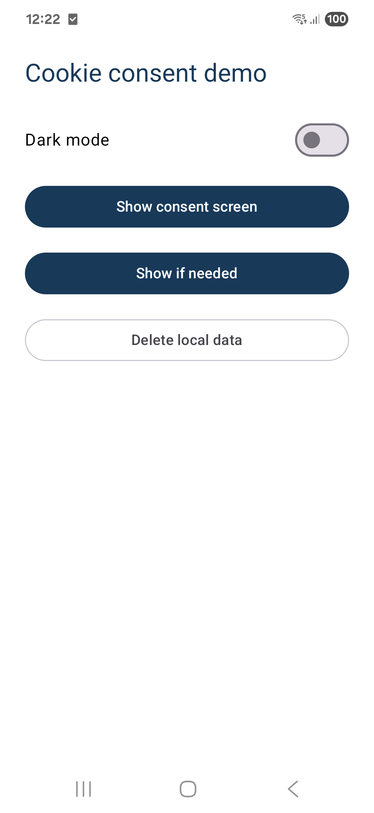
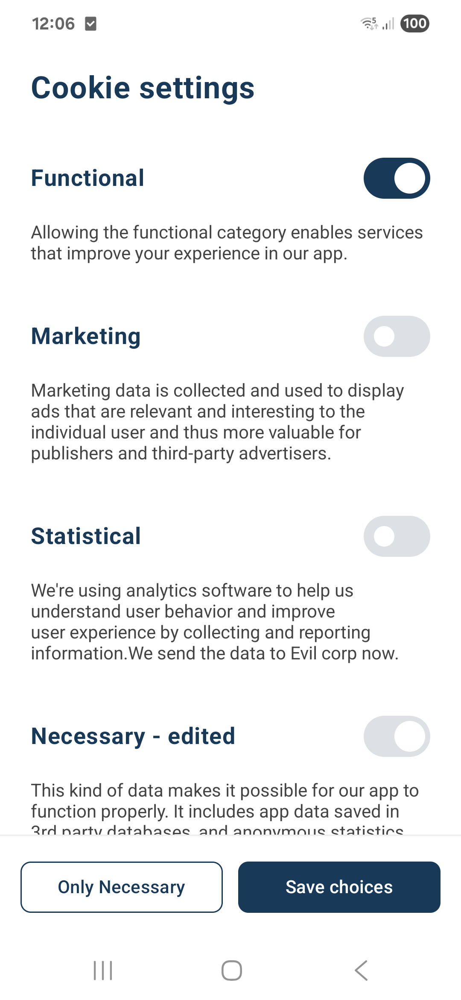
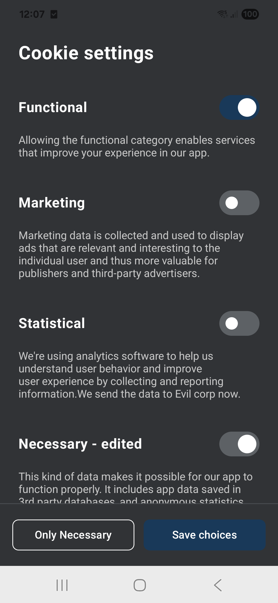

# Custom consent screen (example)

A fully custom cookie consent screen built on the **CORE** SDK
(`com.cookieinformation:core`). All reusable code lives in the
[`consent/`](src/main/java/com/cookieinformation/mobileconsents/custom/consent) folder.
CORE handles networking, caching and offline retry. This package provides only the UI.

## Setup

1. Add the CORE dependency to your module's `build.gradle.kts`:
   ```kotlin
   implementation("com.cookieinformation:core:1.0.0")
   ```
2. Copy the [`consent/`](src/main/java/com/cookieinformation/mobileconsents/custom/consent)
   folder into your project.
3. Register the screen in `AndroidManifest.xml`, inside `<application>`:
   ```xml
   <activity android:name=".consent.ConsentActivity" android:exported="false" />
   ```
4. Initialize prior to calling `show` or `showIfNeeded`:
   ```kotlin
   CookieConsent.configure(
       clientId = "YOUR_CLIENT_ID",
       clientSecret = "YOUR_CLIENT_SECRET",
       solutionId = "YOUR_SOLUTION_ID",
       language = "EN",
   )
   ```
5. Show the screen and read the result. `show` and `showIfNeeded` return a flow that emits the
   user's saved consents once the screen closes. Collect it from a coroutine scope:
   ```kotlin
   lifecycleScope.launch {
       CookieConsent.showIfNeeded(activity).collect { result ->
           result.fold(
               onSuccess = { consents -> consents.forEach { Log.d("TAG", "${it.title}: ${it.accepted}") } },
               onFailure = { Log.d("TAG", it.message ?: "error") },
           )
       }
   }
   ```

`show(activity)` always opens the screen. `showIfNeeded(activity)` opens it only when the user
has not responded to the latest solution; otherwise the flow emits the already saved consents and
the screen never appears. Both accept an optional `userId` and `darkTheme` (`null` follows the
system setting).

## Screenshots

| Demo launcher | Light | Dark |
|---|---|---|
|  |  |  |

## Consent screen buttons

| Button | What it does |
|---|---|
| **Only Necessary** | Accepts the required categories, rejects every optional one regardless of the toggles, then saves. |
| **Save choices** | Saves exactly what the user toggled (required categories stay on). |

Required categories (for example *Necessary*) are shown on and greyed out. They cannot be turned off.

## Demo launcher buttons

| Control | What it does |
|---|---|
| **Dark mode** switch | Forces the consent screen into light or dark, for previewing. |
| **Show consent screen** | Calls `CookieConsent.show(...)`, always shows the screen. |
| **Show if needed** | Calls `CookieConsent.showIfNeeded(...)`, shows it only when consent is needed. |
| **Delete local data** | Calls `CookieConsent.deleteData(...)`, clears locally stored consents. |

## Where to change things

| Change | File |
|---|---|
| Brand color, light and dark palette | [`consent/Color.kt`](src/main/java/com/cookieinformation/mobileconsents/custom/consent/Color.kt) |
| Screen text (title, button labels) | [`res/values/strings.xml`](src/main/res/values/strings.xml) |
| Screen layout | [`consent/ConsentScreen.kt`](src/main/java/com/cookieinformation/mobileconsents/custom/consent/ConsentScreen.kt) |
